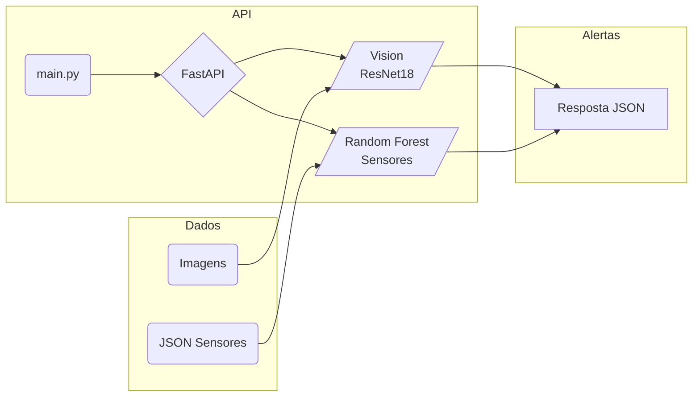

<p align="center">
<a href= "https://www.fiap.com.br/"></a>
</p>

<br>

# Nome do projeto: Global Solution (GS1) - FIAP

## Nome do grupo: Rumo ao NEXT

### 👨‍🎓 Integrantes:

- Felipe Livino dos Santos (RM 563187)
- Daniel Veiga Rodrigues de Faria (RM 561410)
- Tomas Haru Sakugawa Becker (RM 564147)
- Daniel Tavares de Lima Freitas (RM 562625)
- Gabriel Konno Carrozza (RM 564468)

### 👩‍🏫 Professores:

### Tutor(a)

- Leonardo Ruiz Orabona

### Coordenador(a)

- ANDRÉ GODOI CHIOVATO

---

## Visão Geral

Sistema de **monitoramento de risco agrícola** que combina visão computacional, leitura de sensores ambientais e uma API REST em FastAPI para emitir alertas de incêndio, temperatura e umidade em tempo (quase) real.

O projeto integra duas frentes principais:

1. **Visão computacional** — Classifica imagens da plantação como “Incêndio” ou “Sem incêndio” usando um modelo _ResNet18_ fine-tuneado.  
2. **Telemetria de sensores** — Classifica leituras (temperatura, umidade, gás etc.) com um classificador **Random Forest** e gera níveis de risco (`NORMAL`, `ATENCAO`, `ALTO`, `ALERTA MAXIMO`).

---

## Funcionalidades

- **/prediction/img** — Upload de imagem JPEG e retorno imediato do status de incêndio.  
- **/prediction/sensor** — Recebe lote JSON de leituras e devolve nível de risco.  
- **Documentação automática** em `http://localhost:8000/docs`.  
- **Modelos pré-treinados** disponíveis em `saved_models/`, prontos para uso em CPU ou GPU.  
- **Simulação de hardware** no Wokwi (`wokwi/diagram.json`) para testar sensores sem placas físicas.

---

## Arquitetura



ResNet18 foi treinada com imagens rotuladas de fogo/floresta.

Random Forest opera sobre features normalizadas via StandardScaler.

Ambos os modelos são carregados por src/model/main_model.py ao iniciar a API.

## Estrutura de Pastas
```
Caminho	Descrição
assets/	Figuras, logos e materiais estáticos
data/	Conjunto mínimo de testes (imagens)
dados/	CSVs de sensores para treino/validação
saved_models/	Pesos .pth (visão) e .joblib (sensores)
src/	Código-fonte da API e utilitários
notebooks/	Cadernos Jupyter de exploração e treino
nodejs/	Protótipo de back-end Express
wokwi/	Diagrama JSON do circuito ESP32
main.py	Entrypoint FastAPI
requirements.txt	
```

## Pré-requisitos

- Python 3.10+
- Pip ou Poetry
- (Opcional) GPU com CUDA 11+ para acelerar inferência
- Git

---
## Instalação

```bash
`git clone https://github.com/FelipeLivino/GlobalSolution_fase4_fiap.git cd GlobalSolution_fase4_fiap  python -m venv .venv source .venv/bin/activate        # Windows: .venv\Scripts\activate pip install -r requirements.txt`
```

---

## Execução Local

1. **Verifique os modelos**  
    Os arquivos abaixo devem existir. Se necessário, coloque-os manualmente em `saved_models/`:
    
```
modelo_incendio.pth
RandomForest_Optimized_model.joblib
scaler_sensores.joblib
```
    
2. **Inicie o servidor**
    
```bash 
    uvicorn main:app --reload
```

3. **Teste as rotas**
```bash 
# Imagem
curl -F "file=@amostra.jpg" http://localhost:8000/prediction/img

# Sensores
curl -X POST http://localhost:8000/prediction/sensor \
     -H "Content-Type: application/json" \
     -d '{"dados": [[27.5, 1], [30.2, 0]]}'
```

    
4. **Acesse a documentação** em `http://localhost:8000/docs` ou `/redoc`.
    

---

## Referência da API

|Método|Endpoint|Corpo|Resposta|
|---|---|---|---|
|`POST`|`/prediction/img`|Form-Data `file` (JPEG)|`{ "classe": "INCENDIO", "prob": 0.98 }`|
|`POST`|`/prediction/sensor`|`{ "dados": [[float, int], ...] }`|`{ "risco": "ALTO" }`|

Detalhes completos em `/docs`.

## 🗃 Histórico de lançamentos

## 📋 Licença

<p xmlns:cc="http://creativecommons.org/ns#" xmlns:dct="http://purl.org/dc/terms/"><a property="dct:title" rel="cc:attributionURL" href="https://github.com/agodoi/template">MODELO GIT FIAP</a> por <a rel="cc:attributionURL dct:creator" property="cc:attributionName" href="https://fiap.com.br">Fiap</a> está licenciado sobre <a href="http://creativecommons.org/licenses/by/4.0/?ref=chooser-v1" target="_blank" rel="license noopener noreferrer" style="display:inline-block;">Attribution 4.0 International</a>.</p>
