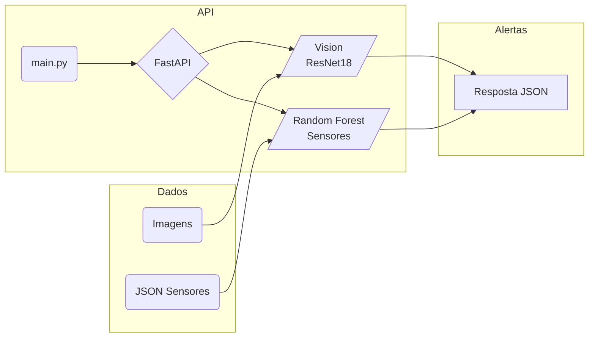
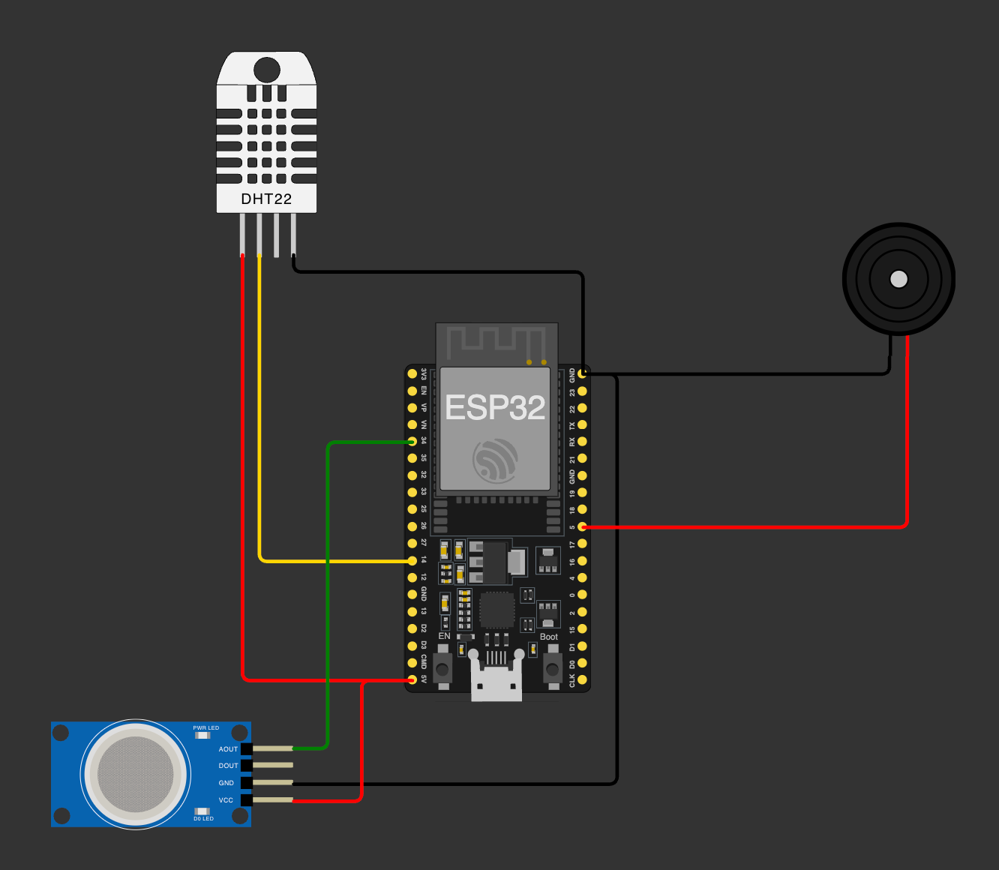

<p align="center">
<a href= "https://www.fiap.com.br/"></a>
</p>

<br>

# Nome do projeto: Global Solution (GS1) - FIAP

## Nome do grupo: Rumo ao NEXT

### 👨‍🎓 Integrantes:

- Felipe Livino dos Santos (RM 563187)
- Daniel Veiga Rodrigues de Faria (RM 561410)
- Tomas Haru Sakugawa Becker (RM 564147)
- Daniel Tavares de Lima Freitas (RM 562625)
- Gabriel Konno Carrozza (RM 564468)

### 👩‍🏫 Professores:

### Tutor(a)

- Leonardo Ruiz Orabona

### Coordenador(a)

- ANDRÉ GODOI CHIOVATO

---

## 🔗 Apresentação em Vídeo (YouTube)

📺 Assista ao vídeo do nosso projeto no canal do youtube:  
👉 [https://youtu.be/-Mz7iqoxxyc](https://youtu.be/-Mz7iqoxxyc)

## Visão Geral

Sistema de **monitoramento de risco agrícola** que combina visão computacional, leitura de sensores ambientais, uma API REST em FastAPI para emitir alertas de incêndio, temperatura e umidade em tempo real e uma API REST em Node.js (Express), para receber os dados do wokwi.

O projeto integra três frentes principais:

1. **Visão computacional** — Classifica imagens da plantação como “Incêndio” ou “Sem incêndio” usando um modelo _ResNet18_ fine-tuneado.  
2. **Telemetria de sensores** — Classifica leituras (temperatura, fumaça) com um classificador **Random Forest** e gera níveis de risco (`NORMAL`, `ATENCAO`, `ALTO`, `ALERTA MAXIMO`).
3. **Armazenamento de dados** - Armazenamento de informações dos sensores.

---

## Funcionalidades

- **/prediction/img** — Upload de imagem JPEG e retorno imediato do status de incêndio.  
- **/prediction/sensor** — Recebe lote JSON de leituras e devolve nível de risco.  
- **Documentação das APIS de predição** em `http://localhost:8000/docs`.  
- **Modelos pré-treinados** disponíveis em `saved_models/`, prontos para uso em CPU ou GPU.  
- **Simulação de hardware** no Wokwi (`wokwi/diagram.json`) para testar sensores sem placas físicas.
- **test_api_postman** no Postman é possível testar o funcionamento das APIs (incluso o curl, caso não tenha o postman instalado).
- 
---

## Arquitetura



ResNet18 foi treinada com imagens rotuladas de incêndio / sem incêndio.

Random Forest opera sobre features normalizadas via StandardScaler.
Ambos os modelos são carregados por src/model/main_model.py ao iniciar a API.

## Estrutura de Pastas
```
Caminho	Descrição
assets/	Figuras, logos e materiais estáticos
data/reports Gráficos gerados pelos cadernos Jupyter
data/upload Armazenamento das imagens recebidas pela API
dados/processados Conjunto de imagens utilizadas no treinamento, testes e validação do modelo ResNet18
dados/sensores Conjunto de usados no treinamento dos sensores
nodejs/banco_dados.sql Arquivo do banco de dados, usada para receber as informações dos sensores, assim como saber a geolocalização de cada sensor
nodejs/ Aplicação em nodejs para receber os dados do wokwi
notebooks/	Cadernos Jupyter de exploração e treino
saved_models/	Modelos de treinamento. Arquivo .pth (imagens) e .joblib (sensores)
test_api_postman/ Contem arquivo de importação para a ferramenta Postman, para o testes dos webservices, assim como o CURLs para execução pelo terminal
wokwi/	Arquivo gerado pela plataforma wokwi com os códigos de funcionamento dos sensores
src/	Código-fonte da API python para predição 
main.py	Entrypoint FastAPI
requirements.txt	
```

## Pré-requisitos

- Python 3.10+
- Pip 
- (Opcional) GPU com CUDA 11+ para acelerar inferência
- Git
- Postman
- Node.js v22.16.0
- MySQL
- Heroku CLI

---
## Instalação

```bash
`git clone https://github.com/FelipeLivino/GlobalSolution_fase4_fiap.git cd GlobalSolution_fase4_fiap  python -m venv .venv source .venv/bin/activate        # Windows: .venv\Scripts\activate pip install -r requirements.txt`
```

---

## Execução Local

1. **Verifique os modelos**  
    Os arquivos abaixo devem existir. Se necessário, coloque-os manualmente em `saved_models/`:
    
```
modelo_incendio.pth
RandomForest_Optimized_model.joblib
scaler_sensores.joblib
```

2. **Instação das bibliotecas

```bash 
    make install_dependences
```

2.1 **Inicie o servidor**
    
```bash 
    uvicorn main:app --reload
```
ou

```bash 
    make run_api
```


3. **Teste as rotas**

**Utilize o Postman**

ou

```bash 
# Imagem
curl -F "file=@amostra.jpg" http://localhost:8000/prediction/img

# Sensores
curl -X POST http://localhost:8000/prediction/sensor \
     -H "Content-Type: application/json" \
     -d '{"dados": [[27.5, 1], [30.2, 0]]}'
```

    
4. **Acesse a documentação** em `http://localhost:8000/docs` ou `/redoc`.
    

---

## Referência da API

|Método|Endpoint|Corpo|Resposta|
|---|---|---|---|
|`POST`|`/prediction/img`|Form-Data `file` (JPEG)|`{ "classe": "INCENDIO", "prob": 0.98 }`|
|`POST`|`/prediction/sensor`|`{ "dados": [[float, int], ...] }`|`{ "risco": "ALTO" }`|

Detalhes completos em `/docs`.


## 🔌 2. Simulador de Circuito – Wokwi (ESP32)

- **Conecta-se ao WiFi** automaticamente (`Wokwi-GUEST`).
- **Aquecimento e regulação do sensor (MQ2)**
  - Aguarda 10 segundos para que o sensor de fumaça aqueça a resistencia e capte informações precisas
  - O sensor  é regulado com o valor de 1ppm 
- **Envio Web**  
   - Forma JSON com campos `status`, `mensagem`, `temperatura`, `valorMQ2`, `id_sensor`.  
   - Envia via HTTP POST e exibe código de resposta.
- **Configura sensores e atuadores**:
  - **Sensor DHT22** (temperatura e umidade).
  - **MQ2** (simula valor de fumaça).
- Coleta os dados a cada 4 segundos:
  - Temperatura, fumaça.
- **Envia os dados coletados em JSON para uma API externa**.
- Também imprime no terminal serial os dados formatado.

## Resumo do Circuito
- **DHT22** — pino 14; use resistor de pull-up de 10 kΩ entre DATA e 5V.  
- **MQ2** — pino 34 (ADC1_CH6); formar divisor com resistor de 10 kΩ.  

## Arquitetura do circuito feito no worki.com




## 🔌 3. Aplicação para receber dados do Circuito – Wokwi (ESP32)
- **Criar conta no heroku (ou algum outro servidor web)**
- **Adicionar o add-on JawsDB MySQL**
  - Após a instalação do add-n deve-se clicar no icone de configuração
  - Receber as credencias e adiciona-las como variaveis de ambiente, assim como no arquivo .envEXAMPLE
- **Configurações no enviroment nodejs**
  - Executar o comando heroku:login e realizar o login na sua conta
  - Iniciar o git com o comando `git init`
  - Adicionar o servidor remoto no repositório `heroku git:remote -a [NOME DO SEU APP]`
  - Adicionar os arquivos no git para subir o servidor `git add .`
  - Realizar o commit `git commit -am "make it better"`
  - Realizar o deploy para o servidor `git push heroku main`
  - O CLI vai informar quando o deploy foi feito e quando o servidor estiver disponível
- **Acessar o Heroku**
  - Ir até a sua aplicação
  - Clicar no botão de abir a aplicação
  - Copiar a URL da aplicação
  - Usar como base [SUA_URL]/fiap/globalSolution e adicionar no wokwi.
- **Salvar e executar a aplicação no wokwi**


## 🗃 Histórico de lançamentos

## 📋 Licença

<p xmlns:cc="http://creativecommons.org/ns#" xmlns:dct="http://purl.org/dc/terms/"><a property="dct:title" rel="cc:attributionURL" href="https://github.com/agodoi/template">MODELO GIT FIAP</a> por <a rel="cc:attributionURL dct:creator" property="cc:attributionName" href="https://fiap.com.br">Fiap</a> está licenciado sobre <a href="http://creativecommons.org/licenses/by/4.0/?ref=chooser-v1" target="_blank" rel="license noopener noreferrer" style="display:inline-block;">Attribution 4.0 International</a>.</p>
